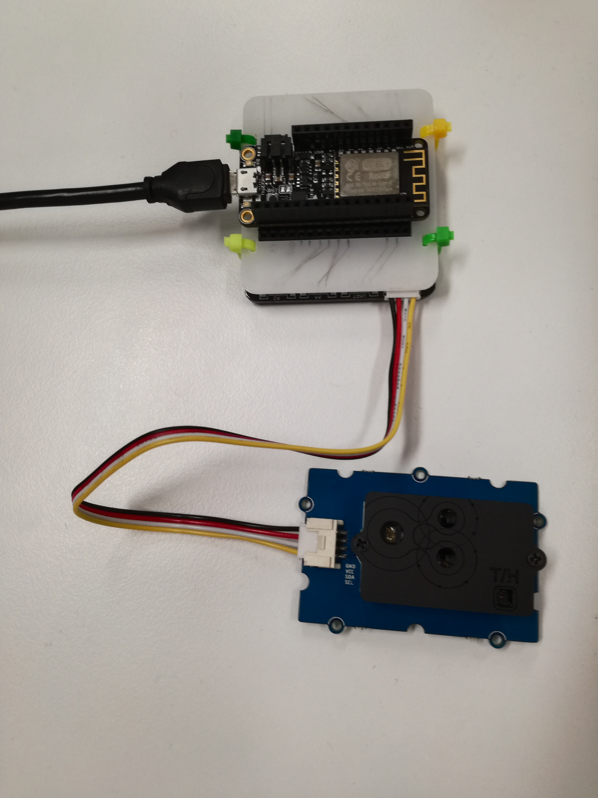

# IoT Engineering
## Project Air Monitor
A CO<sub>2</sub> monitoring system with configurable alert threshold.

## Introduction
This project is part of the [IoT Engineering](../../../fhnw-iot) course.

* 2-person teams, building an IoT system.
* 32 hours of work per person, 1 prototype.
* 10' presentation of the project at Demo Day.
* Slides, source code and setup steps on GitHub.
* Both team members are able to explain the project.

### Team members
* [@patrickackermann](https://github.com/patrickackermann), Patrick Ackermann
* [@fabianw931](https://github.com/fabianw931), Fabian Wildhaber

## Deliverables
The following deliverables are mandatory.

### Source code
> Source code, Arduino C, Python, committed to (this) project repo.

#### Sensor device
> Embedded code / microcontroller firmware.



##### Source code
[arduino/ESP8266_WifiSensorClient/ESP8266_WifiSensorClient.ino](arduino/ESP8266_WifiSensorClient/ESP8266_WifiSensorClient.ino)

##### Setup software
* Edit [ESP8266_WifiSensorClient.ino](arduino/ESP8266_WifiSensorClient/ESP8266_WifiSensorClient.ino) to set WLAN ssid, password and ThingSpeak write api key
    ```
    const char *ssid = SSID;
    const char *password = PASSWORD;
    
    const char *api_key = "8UM10BCWH6OHV1KK";
    ```
    
##### Setup hardware
* The sensor device consists of a [ESP8266](https://github.com/tamberg/fhnw-iot/wiki/Feather-Huzzah-ESP8266), [Grove adapter](https://github.com/tamberg/fhnw-iot/wiki/Grove-Adapters#grove-shield-for-feather) and a [SCD30 sensor](http://wiki.seeedstudio.com/Grove-CO2_Temperature_Humidity_Sensor-SCD30/)
* Stack the ESP8266 on top of the Grove adapter.
* Connect the SCD30 sensor to I2C_1 of the Grove adapter.

#### Actuator device


##### Source code
* [raspi/airMonitor.py](raspi/airMonitor.py)
* [raspi/...](raspi/)

##### Setup software
* clone this repo onto the pi
    ```
    git clone https://github.com/fhnw-iot-5ibb1/fhnw-iot-project-patrick-fabian.git
    ```
* Set ThingSpeak channel and api key in [airMonitor.py](raspi/airMonitor.py)
    ```
    THING_SPEAK_CHANNEL = 935198
    THING_SPEAK_API_KEY = '81SYGRV7PHQU25C8'
    ```
* Install necessary libraries:
    * [pigpio](http://abyz.me.uk/rpi/pigpio/download.html)
    * [grove.py](https://github.com/Seeed-Studio/grove.py#installation)
    * [requests](https://pypi.org/project/requests/)
* start the pigpio deamon
  `sudo pigpiod`

*start the script when the pi boots up:*
* start the pigpio deamon when the pi boots up
  `sudo crontab -e` and then add the following line:
  `@reboot sudo pigpiod`
* install the [`air-monitor.service`](raspi/air-monitor.service) 
  ```
  sudo cp /home/pi/fhnw-iot-project-patrick-fabian/raspi/air-monitor.service /lib/systemd/system/
  sudo systemctl enable air-monitor.service
  ```
  
##### Setup hardware
* The actuator device consists of a [Raspberry Pi Zero W](https://github.com/tamberg/fhnw-iot/wiki/Raspberry-Pi-Zero-W), [Grove adapter](https://github.com/tamberg/fhnw-iot/wiki/Grove-Adapters#grove-base-hat-for-raspberry-pi), [buzzer](https://github.com/tamberg/fhnw-iot/wiki/Grove-Adapters#grove-base-hat-for-raspberry-pi), [LED](https://github.com/tamberg/fhnw-iot/wiki/Grove-Adapters#grove-base-hat-for-raspberry-pi), [button](https://github.com/tamberg/fhnw-iot/wiki/Grove-Adapters#grove-base-hat-for-raspberry-pi), [rotary angle sensor](https://github.com/tamberg/fhnw-iot/wiki/Grove-Adapters#grove-base-hat-for-raspberry-pi), micro servo and a [display](https://github.com/tamberg/fhnw-iot/wiki/Grove-Adapters#grove-base-hat-for-raspberry-pi)
* Stack the Grove adapter on the Raspberry Pi
* Connect the butter to PWM, button to D5, rotary angle sensor to A4, display to D16
* Connect the micro servo to [BCM 18](https://pinout.xyz/), 5V and Ground
* Connect the LED to [BCM 6](https://pinout.xyz/), 3.3V/5V and Ground

#### ThingSpeak backend
> ... IoT platform setup steps.

* Go to http://thingspeak.com
* Create a Channel
* Add _field1_ named _co2(ppm)_
* Add _field2_ named _temp(C)_
* Add _field3_ named _humidity(%)_
* Set channel visibility to public (for demo)

### Presentation
4-slide presentation, PDF format, committed to (this) project repo.

[Docs/AirMonitor.pdf](Docs/AirMonitor.pdf)

1) Use-case of your project.
2) Reference model of your project.
3) Single slide interface documentation.
4) Issues you faced, how you solved them.

### Live demo
Working end-to-end prototype, "device to cloud", part of your 10' presentation.

1) Sensor input on a IoT device triggers an event.

    * Sensor device
        * Use case: Measure temperature, humidity and CO<sub>2</sub>

    * Actuator device
        * Use case: Set the CO<sub>2</sub> limit

2) The event or measurement shows up online, in an app or Web client.

    * Web browser
        * https://thingspeak.com/channels/935198

3) The event triggers actuator output on the same or on a separate IoT device.

    * Actuator device
        * Use case: Alarm when CO<sub>2</sub> measurement too high

## Submission deadline
Commit and push to (this) project repo before Demo Day, _13.01.2020, 00:00_.
